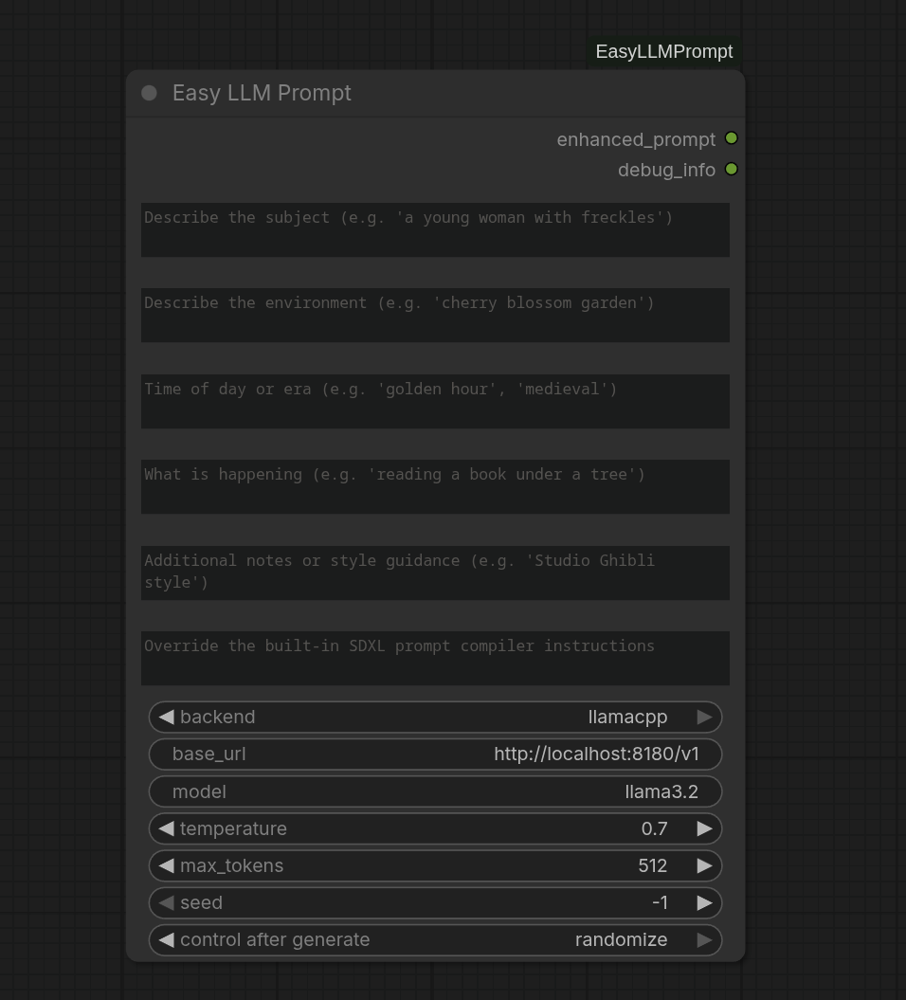

# ComfyUI-EasyLLMPrompt

A ComfyUI custom node that converts a **structured scene description** into a single **optimised Stable Diffusion XL positive prompt** using a local LLM.

**Zero prompt engineering required.** Fill in Subject, Place, Time, Action, and/or Notes; the LLM does the rest.



---

## Features

* **Simple UI** – Five text fields and a few optional settings.
* **Multiple backends** – Ollama, llama.cpp server, OpenAI-compatible (vLLM, LM Studio, LocalAI, etc.).
* **Persistent config** – Backend, URL, model, temperature, and other settings are saved across ComfyUI sessions.
* **Fast** – LRU cache deduplicates identical requests; configurable timeout prevents blocking.
* **Non‑crashing** – All errors are returned as descriptive text; ComfyUI never hangs or crashes.
* **No external dependencies** – Uses only the Python 3 standard library.

---

## Installation

Clone the repository into your ComfyUI `custom_nodes` directory:

```bash
cd ComfyUI/custom_nodes
git clone https://github.com/akumaburn/ComfyUI-EasyLLMPrompt.git
```

Restart ComfyUI. The node appears in the **prompt** category (right‑click → *Add Node* → *prompt* → *Easy LLM Prompt*).

> **No pip install needed.** The node uses only Python standard library modules.

---

## Usage

1. Add the **Easy LLM Prompt** node to your workflow.
2. Fill in the scene description fields:
   - **Subject** – who or what is the focus? (e.g. *a young woman with freckles*)
   - **Place** – where does the scene happen? (e.g. *cherry blossom garden*)
   - **Time** – time of day, era, or season (e.g. *golden hour*)
   - **Action** – what is happening? (e.g. *reading a book under a tree*)
   - **Notes** – style guidance or extra context (e.g. *Studio Ghibli style*)
3. Optionally expand the **optional** section to configure the LLM backend.
4. Connect the **enhanced_prompt** output to your SDXL checkpoint/text encoder.

### Example

| Field | Input |
|-------|-------|
| Subject | `a majestic white wolf with heterochromatic eyes` |
| Place | `frozen tundra under the northern lights` |
| Time | `night, aurora borealis` |
| Action | `howling at the sky` |
| Notes | `photorealistic, cinematic lighting, detailed fur texture` |

The LLM might produce:
```
a majestic white wolf with heterochromatic eyes, detailed fur texture, howling at the sky, frozen tundra under the aurora borealis at night, cinematic lighting, northern lights in the background, photorealistic, award-winning photography, 8K, sharp focus
```

---

## Backend Setup

### Ollama (recommended for beginners)

1. [Download and install Ollama](https://ollama.com/download).
2. Pull a model:
   ```bash
   ollama pull llama3.2
   ```
3. Leave the **Base URL** as `http://localhost:11434` and set **Model** to `llama3.2`.

### llama.cpp server

1. Build or download [llama.cpp](https://github.com/ggerganov/llama.cpp) and start the server:
   ```bash
   ./server -m path/to/model.gguf --host 0.0.0.0 --port 8080
   ```
2. In the node, select **llama.cpp**, set **Base URL** to `http://localhost:8080`, and enter your model name.

### LM Studio

1. Load a model in LM Studio and start the local inference server (default port `1234`).
2. Select **OpenAI Compatible**, set **Base URL** to `http://localhost:1234`, and enter the model name.

### vLLM / LocalAI / other OpenAI-compatible

Start your server, then use the **OpenAI Compatible** backend with the correct base URL.

---

## Configuration

Settings are persisted in a JSON file at:
- ComfyUI user directory: `{ComfyUI}/user/easy_llm_prompt/config.json`
- Fallback: `~/.config/easy_llm_prompt/config.json`

| Setting | Default | Description |
|---------|---------|-------------|
| `default_backend` | `ollama` | Backend to use by default |
| `default_base_url` | `http://localhost:11434` | Default server URL |
| `default_model` | `llama3.2` | Default model name |
| `default_temperature` | `0.7` | Default temperature |
| `default_max_tokens` | `512` | Default max output length |
| `timeout` | `60` | HTTP request timeout (seconds) |
| `cache_size` | `100` | Max LRU cache entries |

You can edit this file manually or change settings per-node through the UI (changes are *not* saved to the config file by the UI – only per‑workflow).

---

## Outputs

| Output | Type | Description |
|--------|------|-------------|
| `enhanced_prompt` | `STRING` | The prompt generated by the LLM |
| `debug_info` | `STRING` | Backend, model, timing, and cache status |

Connect `enhanced_prompt` to your text encoder and `debug_info` to a `ShowText` node for diagnostics.

---

## Error Messages

| Message | Likely cause |
|---------|-------------|
| `ERROR: Connection refused` | The LLM server is not running. |
| `ERROR: Could not resolve hostname` | The URL is incorrect. |
| `ERROR: Request timed out` | The server is too slow; increase the timeout in config. |
| `ERROR: Authentication failed` | The endpoint requires an API key. |
| `ERROR: Endpoint not found` | The URL path is wrong (e.g. missing `/v1`). |
| `ERROR: Unexpected API response` | The model is not a chat model or returned garbage. |

---

## Troubleshooting

**The node returns an empty or nonsensical prompt.**  
Try a different model. Small models (< 3B parameters) often struggle with instruction following.

**The node is slow.**  
Reduce `max_tokens` to 256 or lower. Use a smaller/faster model. Ensure your LLM server runs on the same machine or a fast local network.

**The output contains explanation text.**  
Make sure the **System Prompt** field is empty (the default instructs the LLM to output only the prompt). If you use a custom system prompt, include a "Do not explain anything" directive.

**Settings don't persist.**  
The node reads the config file on startup but does *not* write back. To change defaults, edit the JSON file directly.

---

## Project Structure

```
ComfyUI-EasyLLMPrompt/
├── __init__.py              # ComfyUI node registration
├── pyproject.toml           # Package metadata
├── requirements.txt         # No external dependencies
├── .gitignore
└── easy_llm_prompt/
    ├── __init__.py          # Package version
    ├── node.py              # EasyLLMPromptNode class
    ├── llm_backends.py      # LLM provider implementations
    ├── prompt_builder.py    # System prompt & user message assembly
    ├── cache.py             # LRU request cache
    ├── config.py            # Persistent settings
    └── utils.py             # HTTP helpers, URL normalisation, error handling
```

---

## License

Apache 2.0
